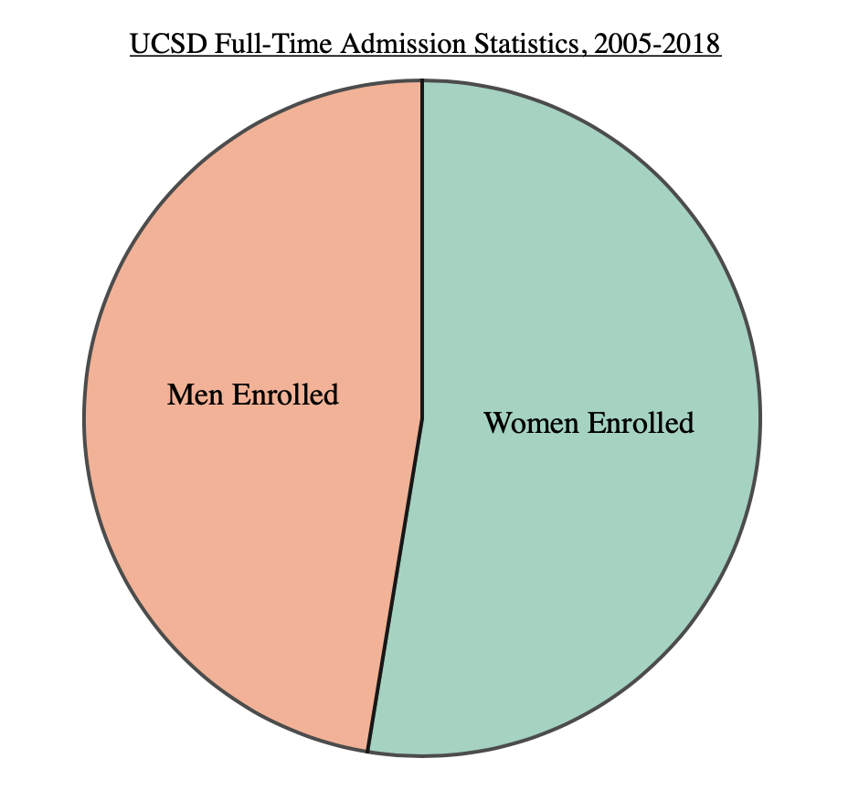

# Homework 1

#### Author:

___Cole Richmond___

# Google G Suite

#### Bar Chart:

#### Line Chart:

#### Pie Chart:

#### Analysis:

# Infogram

#### Bar Chart:

#### Line Chart:

#### Pie Chart:

#### Analysis:

# Tableau Desktop

#### Bar Chart:

#### Line Chart:

#### Pie Chart:

#### Analysis:

# D3

#### Bar Chart:

#### Line Chart:

#### Pie Chart:

#### Analysis:

# Highcharts

#### Bar Chart:

#### Line Chart:

#### Pie Chart:

#### Analysis:
