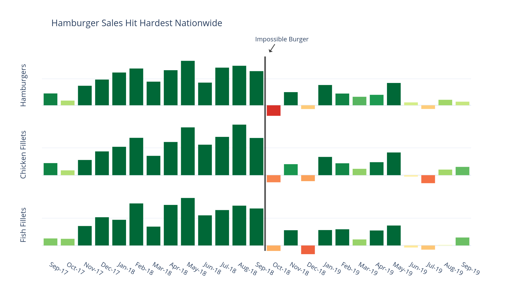

# Impossible Burger: Is Plant-Based Fact-Based?

&nbsp;&nbsp;&nbsp;&nbsp;The country’s fast-food chains are beginning to offer kinder, greener alternatives, and customers are 
buying them in droves. That is a testament to the great advances that food manufacturers have made in producing animal 
products without animals. These plant-based burgers are becoming more common not only because of the ethical appeal, but also 
because they taste good. Rather than trying to convert meat-eaters, companies are trying to appeal to them. A recent article 
from Vox, when describing the recent explosion of Burger King's Impossible Burger, stated:

> *"When the Impossible Burger launched quietly in upscale restaurants a few years ago, the coverage was mostly positive, with 
some reviewers even calling it the future of meat."*

Since it was introduced in October of 2018 the Impossible Burger has become a popular alternative to classic sources of 
protein like beef, chicken, and fish. While the promotion of the meat-replacement product inevitabley drew in first-time users 
looking to form their own opinions, the initial popularity was short-lived in some areas. 

