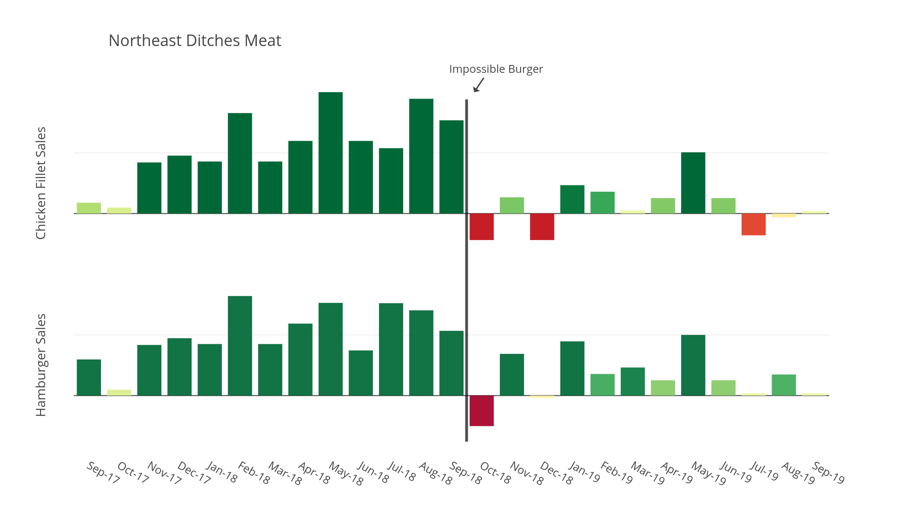

# Impossible Burger: Is Plant-Based Fact-Based?

&nbsp;&nbsp;&nbsp;&nbsp;The country’s fast-food chains are beginning to offer kinder, greener alternatives, and customers are 
buying them in droves. That is a testament to the great advances that food manufacturers have made in producing animal 
products without animals. These plant-based burgers are becoming more common not only because of the ethical appeal, but also 
because they taste good. Rather than trying to convert meat-eaters, companies are trying to appeal to them. A recent article 
from Vox, when describing the recent explosion of Burger King's Impossible Burger, stated:

> *"When the Impossible Burger launched quietly in upscale restaurants a few years ago, the coverage was mostly positive, with 
some reviewers even calling it the future of meat."*

Since it was introduced in October of 2018 the Impossible Burger has become a popular alternative to classic sources of 
protein like beef, chicken, and fish. While the promotion of the meat-replacement product inevitably drew in first-time users 
looking to form their own opinions, sales fluctuated afterward which we'll see later. You can see below that our hamburger 
sales fell well below the nationwide average in October of 2018 falling from $7,922,921 to $6,781,234; a net loss of 
$1,141,687. Chicken and fish fillet sales were also down from September to October, $465,210 and $266,337 respectively. 

Additionally, both hamburger and fish fillet sales took the biggest hit in response to the introduction of the Impossible Burger in our southwest region locations.  

It also seems as though customers in the northeast region ditched meat altogether with both chicken fillet and hamburger sales falling well below the nationwide average.

When looking at sales on a month-to-month basis, we are most successful selling products on Fridays followed by a sharp decrease on the following Saturday. On the earlier sales charts, you can see that hamburgers are more popular during the winter months, and sales decrease as the weather warms up. Therefore, the following chart provides a solid snapshot of how burger sales fluctuate throughout a high-selling month.

Hamburgers and chicken fillets tend to follow the same weekly trend with sales increasing on Fridays and holding fairly steady throughout the weekend. 

Fish fillets also see a spike in sales on Fridays, but tend to drop on Saturday and Sunday falling to values not much higher than what we see during the week.

&nbsp;&nbsp;&nbsp;&nbsp;With meat-based sandwiches selling best in the colder months of the year, it would be in our best interest to push a new plant-based product during the summer months on June, July, and August. We want to keep providing hamburgers and chicken fillets when people want them, but we must compete with the demand for a plant-based during the middle of the year. 

&nbsp;&nbsp;&nbsp;&nbsp;Additonally, our products tend to sell very well during the weekend. If we could find a way to capitalize on our lack of sales during the week with the introduction of a vegan-friendly burger I believe we’d be very pleased with the results.

If you’d like to interact with the charts I showed earlier and print them out for your shareholder meeting later this week, you can find them [here](https://plot.ly/~colerichmond/13/impossible-burger-report/).
